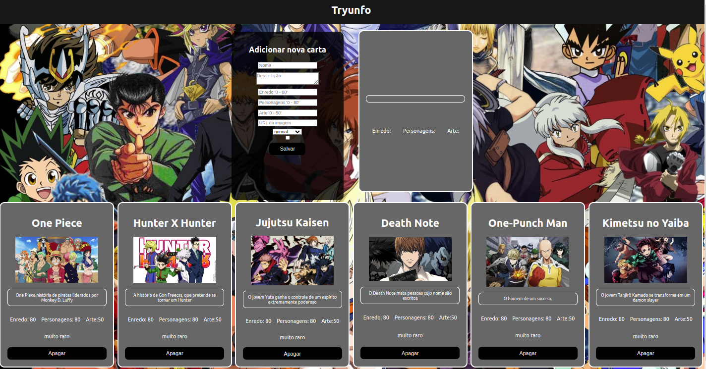

<!-- Olá, Tryber!
Esse é apenas um arquivo inicial para o README do seu projeto.
É essencial que você preencha esse documento por conta própria, ok?
Não deixe de usar nossas dicas de escrita de README de projetos, e deixe sua criatividade brilhar!
:warning: IMPORTANTE: você precisa deixar nítido:
- quais arquivos/pastas foram desenvolvidos por você; 
- quais arquivos/pastas foram desenvolvidos por outra pessoa estudante;
- quais arquivos/pastas foram desenvolvidos pela Trybe.
-->

# Projeto Tryunfo
 
# Contexto
 
Neste projeto foi desenvolvido uma página em React, a página tem 6 cards definidos cada um representando um ótimo anime. cabe ao usuário cadastrar mais animes a lista adicionando nome, descrição, nota para enredo, arte e personagens e um link de imagem.


### Hugo de Sousa Silva
linkedin: https://www.linkedin.com/in/hugo-de-sousa-dev/

#



[Acesse o site aqui.](https://hugodesousa.github.io/tryunfo-cards/)

## Tecnologias usadas

Front-end:
> Desenvolvido com HTML, CSS e JavaScript.
> React
 
#
## Executando aplicação
 
* Para o site direto no navegador:
 
 ```
  https://hugodesousa.github.io/tryunfo-cards/ 
 ```
* Para rodar em uma máquina local
 
 ```
   No terminal rodar os comandos:
 ```
 ```
   git clone git@github.com:Hugodesousa/tryunfo-cards.git
 ```
 ```
   cd tryunfo-cards
 ```
 ```
   npm install
 ```
 ```
   npm start
 ```
#
### Projeto base fornecido pela Trybe
https://www.betrybe.com/
